# Architecture Diagrams

## System Architecture Overview

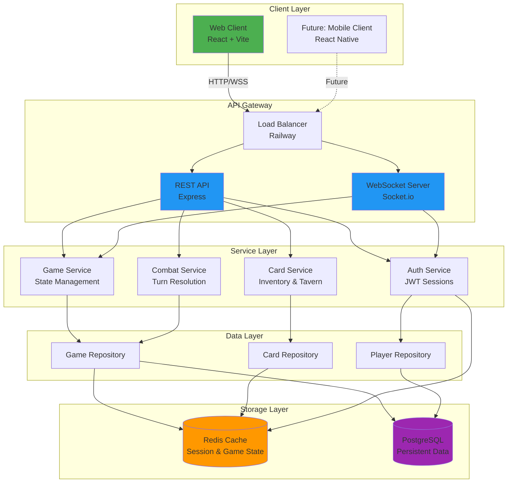

## Request Flow Diagram

### REST Command Flow (State Changes)

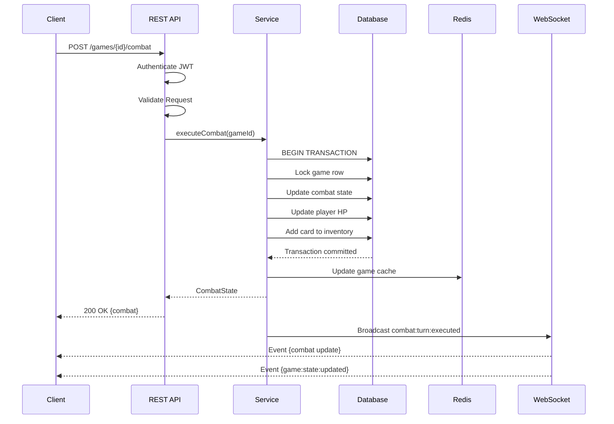

### WebSocket State Synchronization

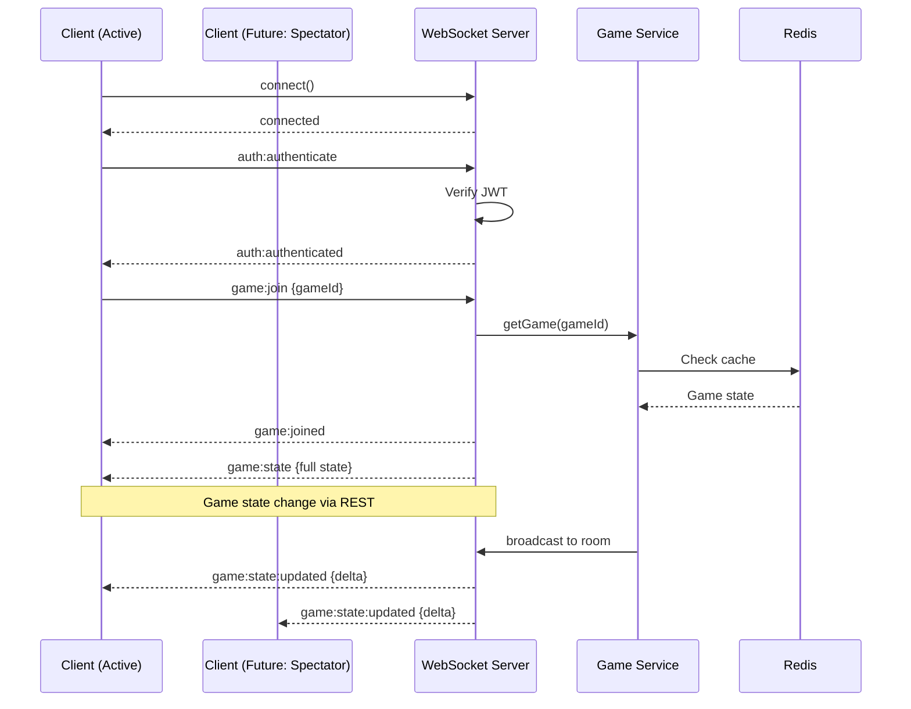

## Service Boundary Diagram

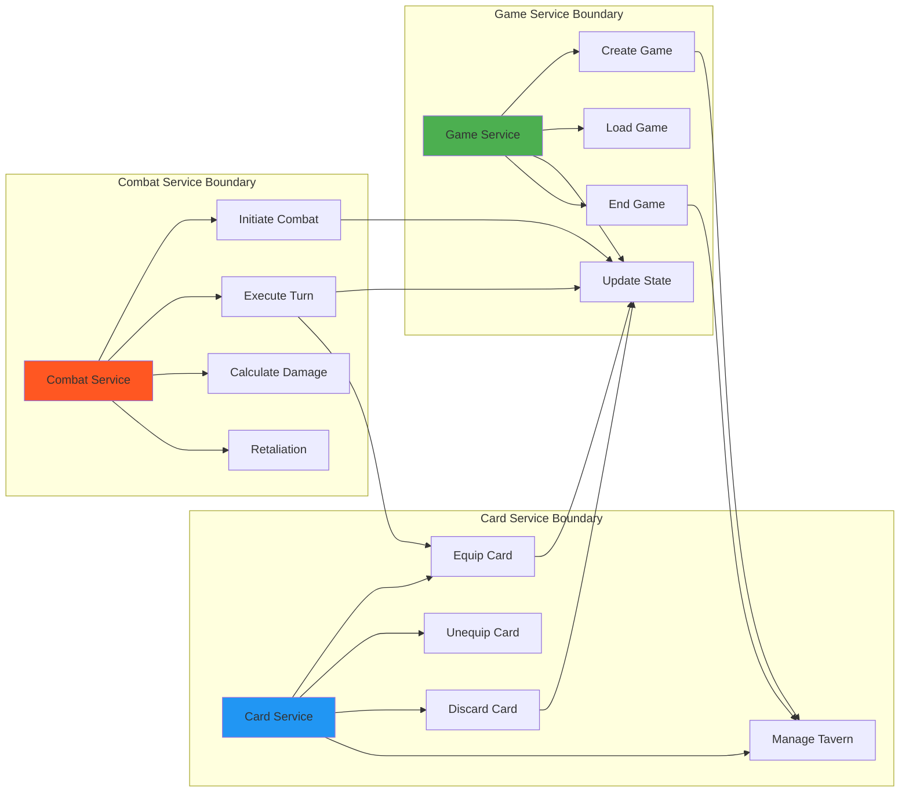

## Data Flow Diagram

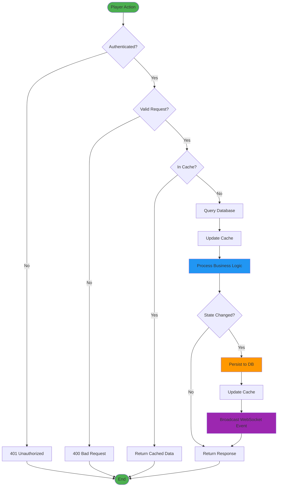

## Combat Resolution Flow

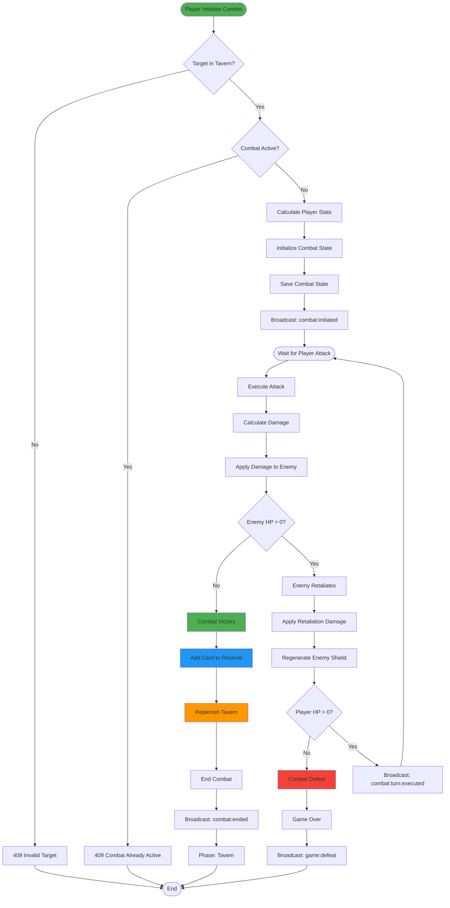

## Caching Architecture

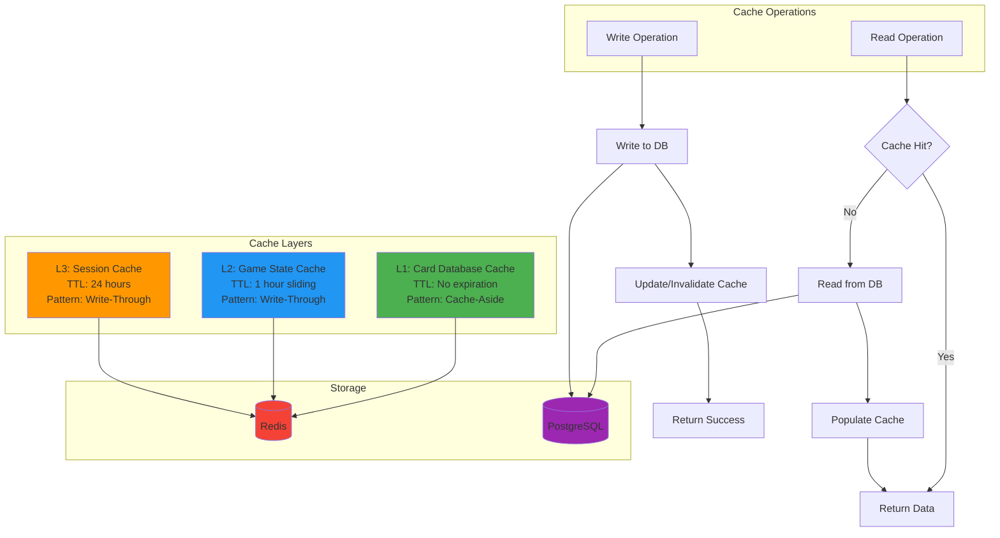

## Authentication Flow

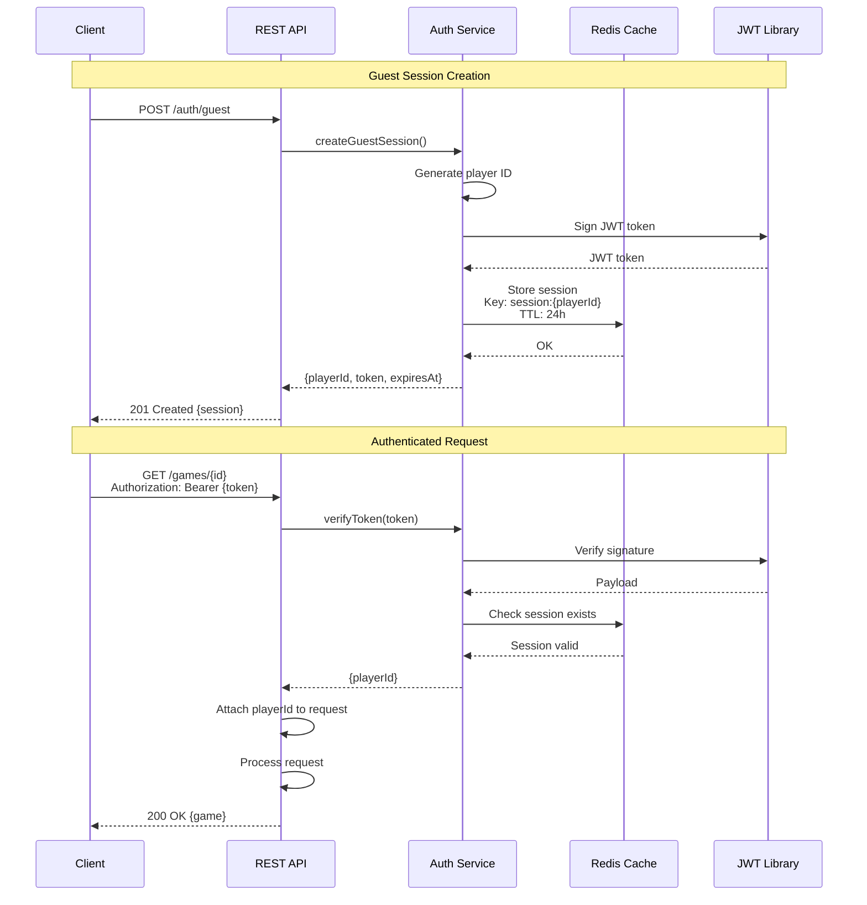

## Deployment Architecture (Railway)

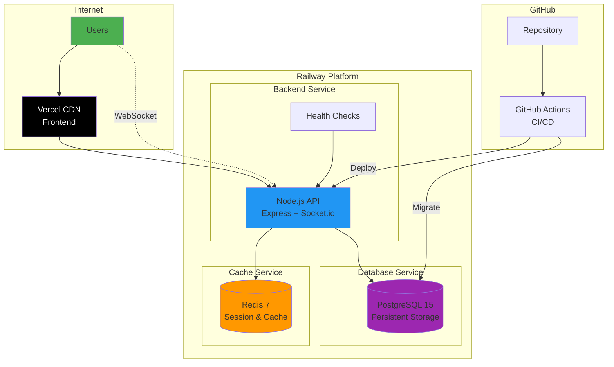

## Error Handling Flow

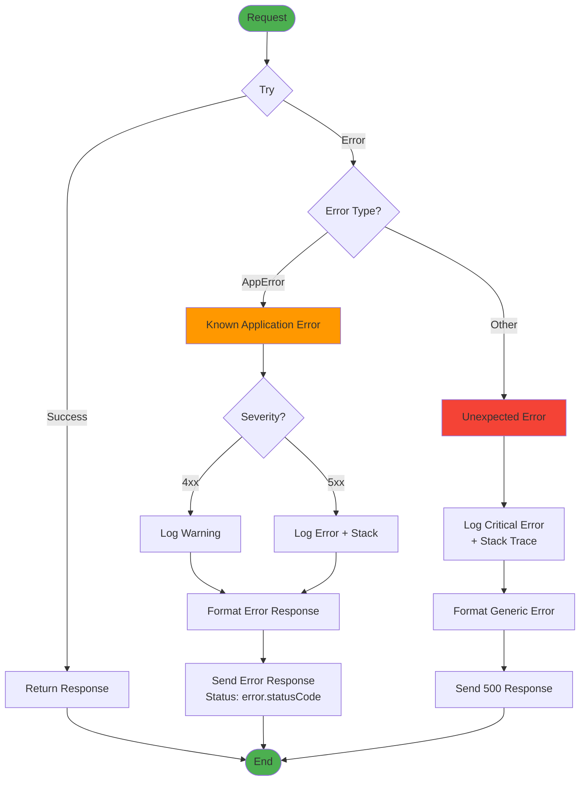

## Future Multiplayer Architecture (Post-MVP)

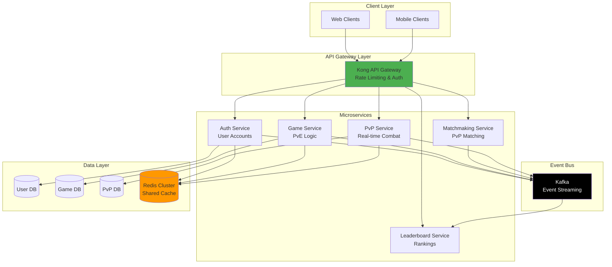

---

**Document Version:** 1.0
**Last Updated:** 2025-11-15
**Purpose:** Visual representation of system architecture
