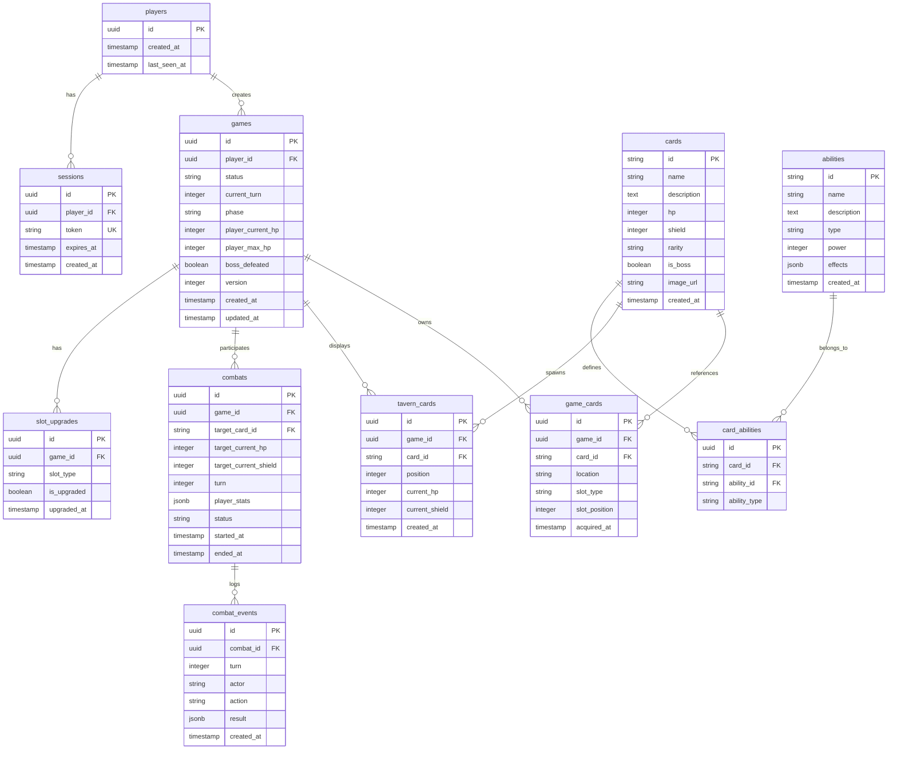

# Tavern Card Game - Database Diagrams

## Entity-Relationship Diagram (ERD)

---

## Database Schema Layers

---

## Data Flow: Game State Load

---

## Data Flow: Combat Resolution

---

## Data Model: Card Inventory System

---

## Data Model: Tavern Card Pool

---

## Data Model: Slot Upgrade System

---

## Index Strategy Visualization

---

## Query Performance Breakdown

**Notes:**
- Queries run in parallel using `Promise.all`
- Slowest query (tavern cards with abilities) determines total time
- Total time: ~40-50ms (database) + ~10ms (cache) = ~60ms

---

## Database Size Estimation

**Total Estimated Size:** ~1.6 GB for 1000 active players

**Growth Rate:**
- Per new player: ~1.6 MB
- Per new game: ~250 KB
- Per combat: ~10 KB

---

## Backup & Recovery Flow

---

## Concurrency Control Strategy

---

**Document Version:** 1.0
**Last Updated:** 2025-11-15
**Status:** Database design visualization complete
