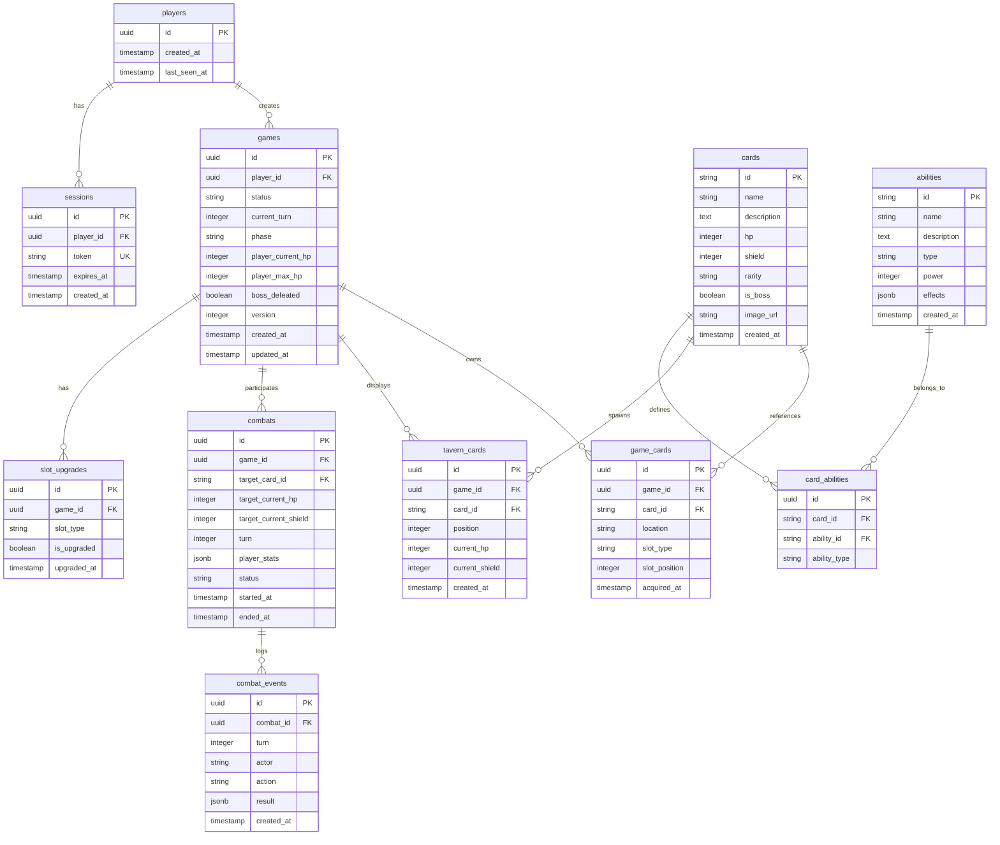

# Tavern Card Game - Database Schema Design

## Entity-Relationship Diagram (ERD)



---

## Table Schemas

### 1. players
**Purpose:** Store player information (guest accounts for MVP)

| Column | Type | Constraints | Description |
|--------|------|-------------|-------------|
| id | UUID | PRIMARY KEY | Unique player identifier |
| created_at | TIMESTAMP | NOT NULL, DEFAULT NOW() | Account creation timestamp |
| last_seen_at | TIMESTAMP | NOT NULL, DEFAULT NOW() | Last activity timestamp |

**Indexes:**
- PRIMARY KEY: `id`

**Notes:**
- Minimal fields for MVP guest authentication
- `last_seen_at` updated on each session validation
- Future: Add username, email, password_hash, oauth fields

---

### 2. sessions
**Purpose:** JWT session management and validation

| Column | Type | Constraints | Description |
|--------|------|-------------|-------------|
| id | UUID | PRIMARY KEY | Unique session identifier |
| player_id | UUID | NOT NULL, FOREIGN KEY → players(id) | Associated player |
| token | VARCHAR(512) | NOT NULL, UNIQUE | JWT token |
| expires_at | TIMESTAMP | NOT NULL | Session expiration |
| created_at | TIMESTAMP | NOT NULL, DEFAULT NOW() | Session creation timestamp |

**Indexes:**
- PRIMARY KEY: `id`
- UNIQUE INDEX: `idx_sessions_token` on `token`
- INDEX: `idx_sessions_player_id` on `player_id`
- INDEX: `idx_sessions_expires_at` on `expires_at` (for cleanup)

**Notes:**
- `token` stored for validation (consider hashing in production)
- Expired sessions cleaned up via scheduled job
- 24-hour TTL configured in application logic

---

### 3. games
**Purpose:** Core game state and session tracking

| Column | Type | Constraints | Description |
|--------|------|-------------|-------------|
| id | UUID | PRIMARY KEY | Unique game identifier |
| player_id | UUID | NOT NULL, FOREIGN KEY → players(id) | Game owner |
| status | VARCHAR(20) | NOT NULL, DEFAULT 'active' | Game status |
| current_turn | INTEGER | NOT NULL, DEFAULT 0 | Current turn number |
| phase | VARCHAR(20) | NOT NULL, DEFAULT 'tavern' | Current game phase |
| player_current_hp | INTEGER | NOT NULL, DEFAULT 0 | Player's current HP (derived from cards) |
| player_max_hp | INTEGER | NOT NULL, DEFAULT 0 | Player's maximum HP (sum of HP cards) |
| boss_defeated | BOOLEAN | NOT NULL, DEFAULT FALSE | Boss victory status |
| version | INTEGER | NOT NULL, DEFAULT 1 | Optimistic locking version |
| created_at | TIMESTAMP | NOT NULL, DEFAULT NOW() | Game creation timestamp |
| updated_at | TIMESTAMP | NOT NULL, DEFAULT NOW() | Last update timestamp |

**Enums:**
- `status`: `active`, `completed`, `abandoned`
- `phase`: `tavern`, `combat`, `management`, `victory`, `defeat`

**Indexes:**
- PRIMARY KEY: `id`
- INDEX: `idx_games_player_id_status` on `(player_id, status)`
- INDEX: `idx_games_updated_at` on `updated_at`

**Constraints:**
- CHECK: `status IN ('active', 'completed', 'abandoned')`
- CHECK: `phase IN ('tavern', 'combat', 'management', 'victory', 'defeat')`
- CHECK: `current_turn >= 0`
- CHECK: `player_current_hp >= 0`
- CHECK: `player_max_hp >= 0`

**Notes:**
- `version` used for optimistic locking (prevent concurrent modifications)
- `player_current_hp` and `player_max_hp` denormalized for performance
- `updated_at` triggers cache invalidation

---

### 4. cards
**Purpose:** Card catalog (all available cards in the game)

| Column | Type | Constraints | Description |
|--------|------|-------------|-------------|
| id | VARCHAR(50) | PRIMARY KEY | Unique card identifier (e.g., "card_001") |
| name | VARCHAR(100) | NOT NULL | Card display name |
| description | TEXT | NULL | Card lore/description |
| hp | INTEGER | NOT NULL | Base HP value |
| shield | INTEGER | NOT NULL, DEFAULT 0 | Base shield value |
| rarity | VARCHAR(20) | NOT NULL, DEFAULT 'common' | Card rarity tier |
| is_boss | BOOLEAN | NOT NULL, DEFAULT FALSE | Boss card flag |
| image_url | VARCHAR(255) | NULL | Card image URL |
| created_at | TIMESTAMP | NOT NULL, DEFAULT NOW() | Card creation timestamp |

**Enums:**
- `rarity`: `common`, `uncommon`, `rare`, `epic`, `legendary`

**Indexes:**
- PRIMARY KEY: `id`
- INDEX: `idx_cards_rarity` on `rarity`
- INDEX: `idx_cards_is_boss` on `is_boss`

**Constraints:**
- CHECK: `rarity IN ('common', 'uncommon', 'rare', 'epic', 'legendary')`
- CHECK: `hp > 0`
- CHECK: `shield >= 0`

**Notes:**
- Catalog table, rarely modified (cache-friendly)
- `id` format: `card_{number}` or `card_boss_{number}`
- All cards preloaded into Redis cache on startup

---

### 5. abilities
**Purpose:** Ability catalog (all available abilities)

| Column | Type | Constraints | Description |
|--------|------|-------------|-------------|
| id | VARCHAR(50) | PRIMARY KEY | Unique ability identifier |
| name | VARCHAR(100) | NOT NULL | Ability display name |
| description | TEXT | NOT NULL | Ability description |
| type | VARCHAR(20) | NOT NULL | Ability effect type |
| power | INTEGER | NOT NULL | Base power value |
| effects | JSONB | NULL | Additional effects (status, duration) |
| created_at | TIMESTAMP | NOT NULL, DEFAULT NOW() | Ability creation timestamp |

**Enums:**
- `type`: `damage`, `heal`, `shield`, `buff`, `debuff`, `special`

**Indexes:**
- PRIMARY KEY: `id`
- INDEX: `idx_abilities_type` on `type`
- GIN INDEX: `idx_abilities_effects` on `effects` (JSONB queries)

**Constraints:**
- CHECK: `type IN ('damage', 'heal', 'shield', 'buff', 'debuff', 'special')`
- CHECK: `power >= 0`

**JSONB Schema (effects):**
```json
{
  "statusEffects": [
    {
      "type": "stun | poison | bleed | burn | freeze",
      "duration": 2,
      "value": 5
    }
  ]
}
```

**Notes:**
- Catalog table, rarely modified
- `effects` allows flexible ability mechanics without schema changes
- Cached with cards on startup

---

### 6. card_abilities
**Purpose:** Junction table mapping cards to their abilities

| Column | Type | Constraints | Description |
|--------|------|-------------|-------------|
| id | UUID | PRIMARY KEY | Unique mapping identifier |
| card_id | VARCHAR(50) | NOT NULL, FOREIGN KEY → cards(id) | Associated card |
| ability_id | VARCHAR(50) | NOT NULL, FOREIGN KEY → abilities(id) | Associated ability |
| ability_type | VARCHAR(20) | NOT NULL | Ability slot type |

**Enums:**
- `ability_type`: `special`, `passive`, `normal`

**Indexes:**
- PRIMARY KEY: `id`
- UNIQUE INDEX: `idx_card_abilities_card_type` on `(card_id, ability_type)`
- INDEX: `idx_card_abilities_ability_id` on `ability_id`

**Constraints:**
- CHECK: `ability_type IN ('special', 'passive', 'normal')`
- UNIQUE: `(card_id, ability_type)` - Each card has 1 ability per type

**Notes:**
- Each card can have up to 3 abilities (one per type)
- Nullable abilities handled by absence of row (not NULL value)
- Eagerly loaded with cards

---

### 7. game_cards
**Purpose:** Player's card inventory (owned cards per game)

| Column | Type | Constraints | Description |
|--------|------|-------------|-------------|
| id | UUID | PRIMARY KEY | Unique inventory entry |
| game_id | UUID | NOT NULL, FOREIGN KEY → games(id) | Associated game |
| card_id | VARCHAR(50) | NOT NULL, FOREIGN KEY → cards(id) | Card reference |
| location | VARCHAR(20) | NOT NULL | Card location |
| slot_type | VARCHAR(20) | NULL | Equipment slot type (if equipped) |
| slot_position | INTEGER | NULL | Position in slot (0 or 1 for dual slots) |
| acquired_at | TIMESTAMP | NOT NULL, DEFAULT NOW() | Acquisition timestamp |

**Enums:**
- `location`: `reserve`, `equipped`
- `slot_type`: `hp`, `shield`, `special`, `passive`, `normal`

**Indexes:**
- PRIMARY KEY: `id`
- INDEX: `idx_game_cards_game_id` on `game_id`
- UNIQUE INDEX: `idx_game_cards_slot_unique` on `(game_id, slot_type, slot_position)` WHERE `location = 'equipped'`

**Constraints:**
- CHECK: `location IN ('reserve', 'equipped')`
- CHECK: `slot_type IN ('hp', 'shield', 'special', 'passive', 'normal')` OR `slot_type IS NULL`
- CHECK: `slot_position IN (0, 1)` OR `slot_position IS NULL`
- CHECK: `(location = 'equipped' AND slot_type IS NOT NULL AND slot_position IS NOT NULL) OR (location = 'reserve' AND slot_type IS NULL AND slot_position IS NULL)`

**Notes:**
- `slot_type` and `slot_position` only set when `location = 'equipped'`
- Unique constraint prevents duplicate equipped cards in same slot
- Cards are never deleted, only moved between locations
- `acquired_at` tracks when card was won from combat

---

### 8. tavern_cards
**Purpose:** Current tavern card pool (9 cards available for combat)

| Column | Type | Constraints | Description |
|--------|------|-------------|-------------|
| id | UUID | PRIMARY KEY | Unique tavern entry |
| game_id | UUID | NOT NULL, FOREIGN KEY → games(id) | Associated game |
| card_id | VARCHAR(50) | NOT NULL, FOREIGN KEY → cards(id) | Card reference |
| position | INTEGER | NOT NULL | Position in tavern (0-8) |
| current_hp | INTEGER | NOT NULL | Current HP (may be damaged) |
| current_shield | INTEGER | NOT NULL | Current shield |
| created_at | TIMESTAMP | NOT NULL, DEFAULT NOW() | Spawn timestamp |

**Indexes:**
- PRIMARY KEY: `id`
- UNIQUE INDEX: `idx_tavern_cards_game_position` on `(game_id, position)`
- INDEX: `idx_tavern_cards_game_id` on `game_id`

**Constraints:**
- CHECK: `position >= 0 AND position <= 8`
- CHECK: `current_hp >= 0`
- CHECK: `current_shield >= 0`

**Notes:**
- Exactly 9 rows per active game (enforced by application logic)
- `current_hp` and `current_shield` track damage between turns
- When card defeated, row deleted and new card inserted (replenish)
- Boss card stored separately (position can be repurposed for boss indicator)

---

### 9. slot_upgrades
**Purpose:** Track which equipment slots have been upgraded to dual capacity

| Column | Type | Constraints | Description |
|--------|------|-------------|-------------|
| id | UUID | PRIMARY KEY | Unique upgrade entry |
| game_id | UUID | NOT NULL, FOREIGN KEY → games(id) | Associated game |
| slot_type | VARCHAR(20) | NOT NULL | Upgraded slot type |
| is_upgraded | BOOLEAN | NOT NULL, DEFAULT TRUE | Upgrade status |
| upgraded_at | TIMESTAMP | NOT NULL, DEFAULT NOW() | Upgrade timestamp |

**Enums:**
- `slot_type`: `hp`, `shield`, `special`, `passive`, `normal`

**Indexes:**
- PRIMARY KEY: `id`
- UNIQUE INDEX: `idx_slot_upgrades_game_slot` on `(game_id, slot_type)`

**Constraints:**
- CHECK: `slot_type IN ('hp', 'shield', 'special', 'passive', 'normal')`

**Notes:**
- Maximum 5 rows per game (one per slot type)
- Presence of row indicates upgrade (regardless of `is_upgraded` value)
- `is_upgraded` always TRUE (allows future downgrade mechanics)
- Alternative design: Add `upgraded` boolean column to `games` table

---

### 10. combats
**Purpose:** Combat session state and history

| Column | Type | Constraints | Description |
|--------|------|-------------|-------------|
| id | UUID | PRIMARY KEY | Unique combat identifier |
| game_id | UUID | NOT NULL, FOREIGN KEY → games(id) | Associated game |
| target_card_id | VARCHAR(50) | NOT NULL, FOREIGN KEY → cards(id) | Enemy card being fought |
| target_current_hp | INTEGER | NOT NULL | Enemy's current HP |
| target_current_shield | INTEGER | NOT NULL | Enemy's current shield |
| turn | INTEGER | NOT NULL, DEFAULT 1 | Combat turn number |
| player_stats | JSONB | NOT NULL | Player stats snapshot |
| status | VARCHAR(20) | NOT NULL, DEFAULT 'active' | Combat status |
| started_at | TIMESTAMP | NOT NULL, DEFAULT NOW() | Combat start timestamp |
| ended_at | TIMESTAMP | NULL | Combat end timestamp |

**Enums:**
- `status`: `active`, `victory`, `defeat`

**Indexes:**
- PRIMARY KEY: `id`
- INDEX: `idx_combats_game_id_status` on `(game_id, status)`
- GIN INDEX: `idx_combats_player_stats` on `player_stats`

**Constraints:**
- CHECK: `status IN ('active', 'victory', 'defeat')`
- CHECK: `target_current_hp >= 0`
- CHECK: `target_current_shield >= 0`
- CHECK: `turn > 0`

**JSONB Schema (player_stats):**
```json
{
  "totalHp": 100,
  "currentHp": 75,
  "totalShield": 30,
  "currentShield": 30,
  "attackPower": 25,
  "abilities": [
    {
      "id": "ability_001",
      "name": "Shield Bash",
      "type": "damage",
      "power": 15
    }
  ]
}
```

**Notes:**
- Only one active combat per game (enforced by application logic)
- `player_stats` denormalized for combat isolation (stats don't change mid-combat)
- `ended_at` set when status changes from `active`
- Completed combats archived for history/replay

---

### 11. combat_events
**Purpose:** Detailed combat log for debugging and replay

| Column | Type | Constraints | Description |
|--------|------|-------------|-------------|
| id | UUID | PRIMARY KEY | Unique event identifier |
| combat_id | UUID | NOT NULL, FOREIGN KEY → combats(id) | Associated combat |
| turn | INTEGER | NOT NULL | Combat turn number |
| actor | VARCHAR(20) | NOT NULL | Who performed action |
| action | VARCHAR(50) | NOT NULL | Action performed |
| result | JSONB | NOT NULL | Action result details |
| created_at | TIMESTAMP | NOT NULL, DEFAULT NOW() | Event timestamp |

**Enums:**
- `actor`: `player`, `enemy`

**Indexes:**
- PRIMARY KEY: `id`
- INDEX: `idx_combat_events_combat_id_turn` on `(combat_id, turn)`
- GIN INDEX: `idx_combat_events_result` on `result`

**Constraints:**
- CHECK: `actor IN ('player', 'enemy')`
- CHECK: `turn > 0`

**JSONB Schema (result):**
```json
{
  "damage": 15,
  "shieldDamage": 10,
  "hpDamage": 5,
  "abilityUsed": "Shield Bash",
  "critical": false,
  "effects": ["stun"]
}
```

**Notes:**
- Append-only table (never updated or deleted)
- Used for combat replay, debugging, analytics
- Consider partitioning by `created_at` for large datasets
- Retained for 30 days, then archived

---

## Database Constraints Summary

### Foreign Key Relationships
```sql
sessions.player_id → players.id ON DELETE CASCADE
games.player_id → players.id ON DELETE CASCADE
card_abilities.card_id → cards.id ON DELETE CASCADE
card_abilities.ability_id → abilities.id ON DELETE CASCADE
game_cards.game_id → games.id ON DELETE CASCADE
game_cards.card_id → cards.id ON DELETE RESTRICT
tavern_cards.game_id → games.id ON DELETE CASCADE
tavern_cards.card_id → cards.id ON DELETE RESTRICT
slot_upgrades.game_id → games.id ON DELETE CASCADE
combats.game_id → games.id ON DELETE CASCADE
combats.target_card_id → cards.id ON DELETE RESTRICT
combat_events.combat_id → combats.id ON DELETE CASCADE
```

**Delete Behavior:**
- `CASCADE`: Deleting parent deletes children (games → game_cards)
- `RESTRICT`: Prevent deletion if references exist (cards referenced by games)

### Triggers

**1. Update `games.updated_at` on modification**
```sql
CREATE OR REPLACE FUNCTION update_updated_at_column()
RETURNS TRIGGER AS $$
BEGIN
    NEW.updated_at = NOW();
    RETURN NEW;
END;
$$ LANGUAGE plpgsql;

CREATE TRIGGER update_games_updated_at
    BEFORE UPDATE ON games
    FOR EACH ROW
    EXECUTE FUNCTION update_updated_at_column();
```

**2. Update `players.last_seen_at` on session validation**
```sql
CREATE OR REPLACE FUNCTION update_player_last_seen()
RETURNS TRIGGER AS $$
BEGIN
    UPDATE players SET last_seen_at = NOW() WHERE id = NEW.player_id;
    RETURN NEW;
END;
$$ LANGUAGE plpgsql;

CREATE TRIGGER update_last_seen_on_session
    AFTER INSERT ON sessions
    FOR EACH ROW
    EXECUTE FUNCTION update_player_last_seen();
```

**3. Auto-calculate player HP when cards change**
```sql
CREATE OR REPLACE FUNCTION recalculate_player_hp()
RETURNS TRIGGER AS $$
BEGIN
    UPDATE games g
    SET
        player_max_hp = (
            SELECT COALESCE(SUM(c.hp), 0)
            FROM game_cards gc
            JOIN cards c ON gc.card_id = c.id
            WHERE gc.game_id = COALESCE(NEW.game_id, OLD.game_id)
              AND gc.location = 'equipped'
              AND gc.slot_type = 'hp'
        ),
        player_current_hp = LEAST(
            player_current_hp,
            (SELECT COALESCE(SUM(c.hp), 0)
             FROM game_cards gc
             JOIN cards c ON gc.card_id = c.id
             WHERE gc.game_id = COALESCE(NEW.game_id, OLD.game_id)
               AND gc.location = 'equipped'
               AND gc.slot_type = 'hp')
        )
    WHERE g.id = COALESCE(NEW.game_id, OLD.game_id);

    RETURN COALESCE(NEW, OLD);
END;
$$ LANGUAGE plpgsql;

CREATE TRIGGER recalculate_hp_on_card_change
    AFTER INSERT OR UPDATE OR DELETE ON game_cards
    FOR EACH ROW
    WHEN (NEW.slot_type = 'hp' OR OLD.slot_type = 'hp')
    EXECUTE FUNCTION recalculate_player_hp();
```

---

## Data Access Patterns

### Frequently Used Queries

#### 1. **Load Complete Game State**
```sql
-- Main game data
SELECT * FROM games WHERE id = $1;

-- Equipped cards
SELECT gc.*, c.*,
       json_agg(
         json_build_object(
           'id', a.id,
           'name', a.name,
           'type', ca.ability_type,
           'power', a.power,
           'description', a.description
         )
       ) FILTER (WHERE a.id IS NOT NULL) as abilities
FROM game_cards gc
JOIN cards c ON gc.card_id = c.id
LEFT JOIN card_abilities ca ON c.id = ca.card_id
LEFT JOIN abilities a ON ca.ability_id = a.id
WHERE gc.game_id = $1 AND gc.location = 'equipped'
GROUP BY gc.id, c.id;

-- Reserve cards
SELECT gc.*, c.*
FROM game_cards gc
JOIN cards c ON gc.card_id = c.id
WHERE gc.game_id = $1 AND gc.location = 'reserve';

-- Tavern cards
SELECT tc.*, c.*,
       json_agg(
         json_build_object(
           'id', a.id,
           'name', a.name,
           'type', ca.ability_type,
           'power', a.power
         )
       ) FILTER (WHERE a.id IS NOT NULL) as abilities
FROM tavern_cards tc
JOIN cards c ON tc.card_id = c.id
LEFT JOIN card_abilities ca ON c.id = ca.card_id
LEFT JOIN abilities a ON ca.ability_id = a.id
WHERE tc.game_id = $1
GROUP BY tc.id, c.id
ORDER BY tc.position;

-- Slot upgrades
SELECT slot_type, is_upgraded
FROM slot_upgrades
WHERE game_id = $1;

-- Active combat
SELECT * FROM combats
WHERE game_id = $1 AND status = 'active'
LIMIT 1;
```

**Optimization:** Single transaction, multiple queries. Consider using CTEs or JOINs for atomic load.

---

#### 2. **Get Card Catalog (with abilities)**
```sql
SELECT c.*,
       json_agg(
         json_build_object(
           'type', ca.ability_type,
           'id', a.id,
           'name', a.name,
           'description', a.description,
           'power', a.power,
           'effects', a.effects
         )
       ) FILTER (WHERE a.id IS NOT NULL) as abilities
FROM cards c
LEFT JOIN card_abilities ca ON c.id = ca.card_id
LEFT JOIN abilities a ON ca.ability_id = a.id
GROUP BY c.id
ORDER BY c.rarity, c.name;
```

**Caching:** Entire result cached in Redis (`cards:all`) indefinitely.

---

#### 3. **Equip Card Transaction**
```sql
BEGIN;

-- Lock game for optimistic concurrency control
SELECT version FROM games WHERE id = $1 FOR UPDATE;

-- Check slot capacity
SELECT COUNT(*) FROM game_cards
WHERE game_id = $1
  AND slot_type = $2
  AND location = 'equipped';

-- Check if slot is upgraded
SELECT is_upgraded FROM slot_upgrades
WHERE game_id = $1 AND slot_type = $2;

-- Move card from reserve to equipped
UPDATE game_cards
SET location = 'equipped',
    slot_type = $2,
    slot_position = $3
WHERE game_id = $1
  AND card_id = $4
  AND location = 'reserve';

-- Increment game version
UPDATE games
SET version = version + 1,
    updated_at = NOW()
WHERE id = $1;

COMMIT;
```

**Concurrency:** Uses optimistic locking via `version` column. Retry on conflict.

---

#### 4. **Combat Resolution (Atomic Transaction)**
```sql
BEGIN;

-- Get active combat
SELECT * FROM combats
WHERE game_id = $1 AND status = 'active'
FOR UPDATE;

-- Apply damage to enemy
UPDATE tavern_cards
SET current_hp = GREATEST(current_hp - $2, 0),
    current_shield = GREATEST(current_shield - $3, 0)
WHERE game_id = $1 AND card_id = $4;

-- Log player attack
INSERT INTO combat_events (combat_id, turn, actor, action, result)
VALUES ($5, $6, 'player', 'attack', $7::jsonb);

-- Check if enemy defeated
SELECT current_hp FROM tavern_cards
WHERE game_id = $1 AND card_id = $4;

-- If defeated, acquire card
IF enemy_hp <= 0 THEN
  INSERT INTO game_cards (game_id, card_id, location)
  VALUES ($1, $4, 'reserve');

  DELETE FROM tavern_cards
  WHERE game_id = $1 AND card_id = $4;

  -- Replenish tavern (spawn new card at position)
  INSERT INTO tavern_cards (game_id, card_id, position, current_hp, current_shield)
  SELECT $1, c.id, $8, c.hp, c.shield
  FROM cards c
  WHERE c.id = (SELECT id FROM cards WHERE is_boss = FALSE ORDER BY RANDOM() LIMIT 1);

  -- End combat
  UPDATE combats
  SET status = 'victory',
      ended_at = NOW()
  WHERE id = $5;
ELSE
  -- Enemy retaliates
  UPDATE games
  SET player_current_hp = GREATEST(player_current_hp - $9, 0)
  WHERE id = $1;

  -- Log enemy retaliation
  INSERT INTO combat_events (combat_id, turn, actor, action, result)
  VALUES ($5, $6, 'enemy', 'retaliate', $10::jsonb);

  -- Increment combat turn
  UPDATE combats
  SET turn = turn + 1
  WHERE id = $5;
END IF;

COMMIT;
```

**ACID Compliance:** Entire combat round is atomic. Either all updates succeed or all rollback.

---

#### 5. **List Player Games**
```sql
SELECT id, status, phase, current_turn, boss_defeated, created_at, updated_at
FROM games
WHERE player_id = $1
  AND ($2::varchar IS NULL OR status = $2)
ORDER BY updated_at DESC
LIMIT $3 OFFSET $4;

-- Count total
SELECT COUNT(*) FROM games
WHERE player_id = $1
  AND ($2::varchar IS NULL OR status = $2);
```

**Optimization:** Lightweight projection (no JOINs), indexed on `(player_id, status)`.

---

#### 6. **Session Validation**
```sql
SELECT s.*, p.id as player_id
FROM sessions s
JOIN players p ON s.player_id = p.id
WHERE s.token = $1
  AND s.expires_at > NOW();
```

**Optimization:** Unique index on `token`, expires check prevents stale sessions.

---

#### 7. **Combat History (Replay)**
```sql
SELECT ce.*, c.target_card_id, c.player_stats
FROM combat_events ce
JOIN combats c ON ce.combat_id = c.id
WHERE c.game_id = $1
  AND ($2::uuid IS NULL OR c.id = $2)
ORDER BY c.started_at, ce.turn, ce.created_at;
```

**Use Case:** Debugging, replay animations, analytics.

---

## Query Optimization Strategy

### Indexing Guidelines

1. **Primary Keys:** All tables have UUID or VARCHAR primary keys with B-tree indexes
2. **Foreign Keys:** All FK columns indexed for JOIN performance
3. **Composite Indexes:** For common multi-column WHERE clauses
4. **Partial Indexes:** For status-based queries (e.g., `WHERE status = 'active'`)
5. **JSONB Indexes:** GIN indexes for JSONB column queries

### Index Definitions

```sql
-- Games
CREATE INDEX idx_games_player_id_status ON games(player_id, status);
CREATE INDEX idx_games_updated_at ON games(updated_at);

-- Sessions
CREATE UNIQUE INDEX idx_sessions_token ON sessions(token);
CREATE INDEX idx_sessions_player_id ON sessions(player_id);
CREATE INDEX idx_sessions_expires_at ON sessions(expires_at);

-- Cards
CREATE INDEX idx_cards_rarity ON cards(rarity);
CREATE INDEX idx_cards_is_boss ON cards(is_boss);

-- Abilities
CREATE INDEX idx_abilities_type ON abilities(type);
CREATE INDEX idx_abilities_effects ON abilities USING GIN (effects);

-- Card Abilities
CREATE UNIQUE INDEX idx_card_abilities_card_type ON card_abilities(card_id, ability_type);
CREATE INDEX idx_card_abilities_ability_id ON card_abilities(ability_id);

-- Game Cards
CREATE INDEX idx_game_cards_game_id ON game_cards(game_id);
CREATE UNIQUE INDEX idx_game_cards_slot_unique ON game_cards(game_id, slot_type, slot_position) WHERE location = 'equipped';

-- Tavern Cards
CREATE UNIQUE INDEX idx_tavern_cards_game_position ON tavern_cards(game_id, position);
CREATE INDEX idx_tavern_cards_game_id ON tavern_cards(game_id);

-- Slot Upgrades
CREATE UNIQUE INDEX idx_slot_upgrades_game_slot ON slot_upgrades(game_id, slot_type);

-- Combats
CREATE INDEX idx_combats_game_id_status ON combats(game_id, status);
CREATE INDEX idx_combats_player_stats ON combats USING GIN (player_stats);

-- Combat Events
CREATE INDEX idx_combat_events_combat_id_turn ON combat_events(combat_id, turn);
CREATE INDEX idx_combat_events_result ON combat_events USING GIN (result);
```

### Performance Considerations

1. **Connection Pooling:** Use Knex connection pool (min: 2, max: 10)
2. **Prepared Statements:** All queries use parameterized statements
3. **Batch Operations:** Use batch inserts for tavern replenishment
4. **Read Replicas:** Future: Separate read/write connections
5. **VACUUM:** Schedule VACUUM ANALYZE for frequently updated tables (games, combats)

---

## Data Consistency Requirements

### ACID Transactions

**Critical Operations:**
1. Combat resolution (damage, card acquisition, tavern replenishment)
2. Card equip/unequip with slot validation
3. Game state transitions (phase changes)
4. Slot upgrades with card discard

**Transaction Isolation Level:** `READ COMMITTED` (default PostgreSQL)
- Prevents dirty reads
- Allows non-repeatable reads (acceptable for game state)
- Use `SELECT FOR UPDATE` for critical rows (games, combats)

### Optimistic Locking

**Implementation:**
```sql
UPDATE games
SET status = $1,
    phase = $2,
    version = version + 1
WHERE id = $3
  AND version = $4; -- Optimistic lock check

-- If rowCount = 0, conflict detected → retry
```

**Applied To:**
- Game state updates
- Combat resolution
- Card operations

**Retry Strategy:**
- Max 3 retries with exponential backoff
- Refresh game state between retries
- Return conflict error to client after retries exhausted

### Data Integrity Rules

1. **Slot Capacity Enforcement:**
   - Single slot: Max 1 card
   - Dual slot (upgraded): Max 2 cards
   - Validated in application + DB constraint

2. **Tavern Invariants:**
   - Exactly 9 cards at all times
   - Defeated card → replenish immediately (atomic)

3. **Combat State:**
   - Only 1 active combat per game
   - Combat stats isolated (snapshot at combat start)

4. **Player HP Bounds:**
   - `0 <= current_hp <= max_hp`
   - `max_hp = SUM(equipped HP cards)`

---

## Migration Strategy

**Migration Tool:** Knex.js

**File Naming Convention:**
```
migrations/
  yyyyMMddHHmmss_migration_name.js
```

**Migration Guidelines:**
1. Each migration atomic (single transaction)
2. Reversible (implement `down()` method)
3. Idempotent (safe to run multiple times)
4. Test migrations on copy of production data

**Deployment Process:**
```bash
# Development
npm run migrate:latest

# Production
npm run migrate:latest -- --env production
```

**Rollback Process:**
```bash
# Rollback last migration
npm run migrate:rollback

# Rollback to specific version
npm run migrate:rollback -- --to 20251115000000
```

---

## Seed Data Strategy

**Seed Files:**
- `seeds/001_cards.js` - Card catalog (50+ cards)
- `seeds/002_abilities.js` - Ability catalog
- `seeds/003_card_abilities.js` - Card-ability mappings

**Seed Data Characteristics:**
- Deterministic IDs (`card_001`, `ability_shield_bash`)
- Balanced rarity distribution (50% common, 25% uncommon, 15% rare, 8% epic, 2% legendary)
- 3-5 boss cards
- Each card has 1-3 abilities

**Development vs Production:**
- Development: Full seed data + test player accounts
- Production: Only card/ability catalog (no test players)

---

## Backup & Recovery

### Backup Strategy

**Daily Full Backup:**
```bash
pg_dump -Fc tavern_db > backup_$(date +%Y%m%d).dump
```

**Hourly Incremental Backup (WAL archiving):**
```sql
-- postgresql.conf
archive_mode = on
archive_command = 'cp %p /backup/wal/%f'
```

**Retention Policy:**
- Daily backups: 30 days
- Hourly WAL: 7 days

### Recovery Strategy

**Point-in-Time Recovery (PITR):**
```bash
# Restore base backup
pg_restore -d tavern_db backup_20251115.dump

# Apply WAL logs up to specific time
recovery_target_time = '2025-11-15 14:30:00'
```

**Disaster Recovery:**
1. Restore from daily backup (max 24 hours data loss)
2. Apply WAL logs (reduce to minutes)
3. Validate data integrity
4. Resume service

---

## Monitoring & Maintenance

### Key Metrics

1. **Query Performance:**
   - Slow query log (> 100ms)
   - Most frequent queries
   - Table scan frequency

2. **Database Health:**
   - Connection pool utilization
   - Transaction rollback rate
   - Deadlock frequency
   - Table bloat

3. **Storage:**
   - Database size growth
   - Index size
   - WAL disk usage

### Maintenance Tasks

**Daily:**
- Check slow query log
- Monitor connection pool

**Weekly:**
- VACUUM ANALYZE heavy tables
- Review index usage

**Monthly:**
- Reindex fragmented indexes
- Archive old combat logs
- Review table statistics

---

## Future Enhancements

### Post-MVP Features

1. **Player Accounts:**
   - Add `username`, `email`, `password_hash` to `players`
   - OAuth integration (add `oauth_providers` table)

2. **Multiplayer:**
   - Add `game_players` junction table
   - Add `player_turns` table for turn order

3. **Leaderboards:**
   - Add `player_stats` table (wins, losses, high scores)
   - Add `achievements` table

4. **Card Trading:**
   - Add `trades` table
   - Add `trade_offers` table

5. **Analytics:**
   - Add `analytics_events` table
   - Track card usage frequency
   - Track win rates per card

### Schema Evolution

**Versioning Strategy:**
- Database schema version tracked in `schema_migrations` (Knex default)
- API version in URL (`/api/v1`, `/api/v2`)
- Support N-1 versions for backward compatibility

---

**Document Version:** 1.0
**Last Updated:** 2025-11-15
**Status:** MVP Database Schema Design
